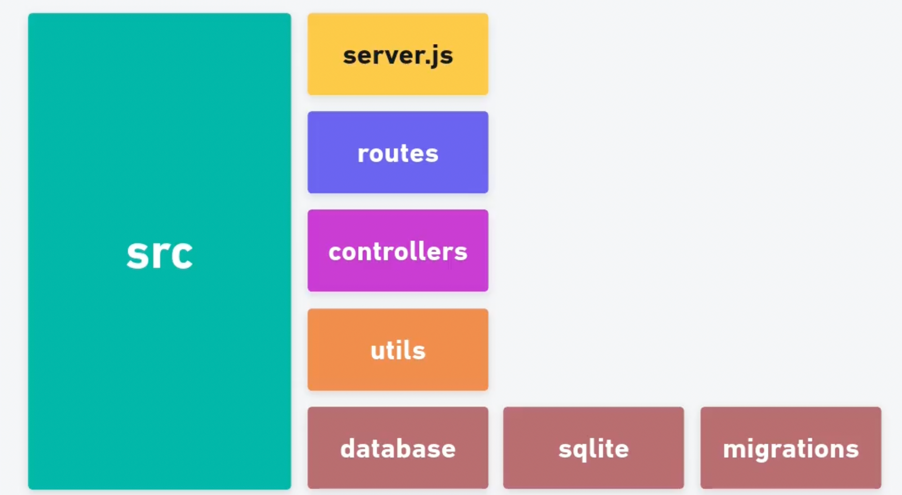

# Creating My First API
This project is about the creation of an API about movies.

## 📚 Learnings
- Configuration of Node.js
- How to use and configure package.json
- NPM & NPX
- Request/Response
- Node Express
- Nodemon
- Query Params
- Controllers
- Project Architecture
- HTTP Codes
- Database Connection
- Migrations

## 🚀 Technologies/Tools
- JavaScript
- Node.js
- Knex.js
- Beekeeper Studio
- SQLite

## 📐 Project Structure


## 📊 Data Base Structure


## ▶️ Running
Clone the project with:
```bash
  git clone https://github.com/DevBonatto/FirstAPI.git
```

Then use this command to install the dependencies:
```bash
  npm install
```

To start:
```bash
  npm start
```

Develop:
```bash
  npm run dev
```
